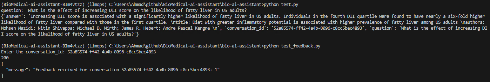

# BioMedical AI Assistant

<p align="center">
  
</p>

Accessing and analyzing large-scale biomedical research can be a daunting task, especially for non-experts. The sheer volume of data from major biomedical repositories often requires specialized tools and expertise. This project aims to leverage Large Language Models (LLMs) to create a conversational AI that can answer end-user questions about biomedical research, making it more accessible and manageable.

This project was implemented for the [LLM Zoomcamp](https://github.com/DataTalksClub/llm-zoomcamp) - a free course about LLMs and Retrieval-Augmented Generation (RAG).

## Project Overview

The Biomedical Research Assistant is a RAG application designed to assist users with their biomedical research queries.

The main use cases include:

1. **Research Query Answering:** Providing answers to questions based on a large-scale biomedical database.
2. **Article Summary:** Summarizing research articles to help users quickly grasp the key points.
3. **Related Research:** Recommending related research articles based on the user's query.
4. **Conversational Interaction:** Making it easy to get information without sifting through extensive literature.

## Dataset

The dataset used in this project is the [BREATHE BioMedical Literature Dataset](https://console.cloud.google.com/marketplace/product/breathe-gcp-public-data/breathe?hl=en-GB&pli=1&project=demoagent-b1c1f) from Nature, containing 125,530 records. For this project, a random sample of 1000 articles was retrieved from this dataset using BigQuery on Google Cloud Platform (GCP). The sample data has already been retrieved from BigQuery and saved as JSONL file on [Google Drive](https://drive.google.com/file/d/1-QDivpbaTgG75PpLjap7BOc6LA0DqpjE/view?usp=sharing)

Each record includes:

- **Abstract:** A brief summary of the research article.
- **Authors:** The names of the authors.
- **Keywords:** Relevant keywords associated with the article.
- **Organization Affiliated:** The organization affiliated with the authors.
- **Title:** The title of the research article.
- **ID:** A unique identifier for each article.

The following SQL statement has been used to retrieve the random sample dataset from BigQuery on GCP:

```sql
SELECT
  REGEXP_REPLACE(abstract, r'\s+', ' ') AS abstract,
  REGEXP_REPLACE(authors, r'\s+', ' ') AS authors,
  REGEXP_REPLACE(keywords, r'\s+', ' ') AS keywords,
  REGEXP_REPLACE(organization_affiliated, r'\s+', ' ') AS organization_affiliated,
  REGEXP_REPLACE(title, r'\s+', ' ') AS title,
  id
FROM
  `bigquery-public-data.breathe.nature`
WHERE
  abstract IS NOT NULL
  AND authors IS NOT NULL
  AND keywords IS NOT NULL
  AND organization_affiliated IS NOT NULL
  AND title IS NOT NULL
  AND id IS NOT NULL
ORDER BY
  RAND()
LIMIT
  1000;
```

## Technologies

- **Python 3.12:** The primary programming language.
- **Docker and Docker Compose:** For containerization.
- **Minsearch:** For in-memory database and efficient text search.
- **Flask:** As the API interface.
- **Grafana:** For monitoring and visualization.
- **Google Cloud Platform (GCP):** Cloud platform for hosting and running the application.
- **BigQuery:** Serverless data warehouse for querying, preparing, and retrieving the biomedical dataset.
- **Vertex AI:** For deploying and managing the Gemini LLMs.
- **Gemini 1.5 Flash 001:** The main Large Language Model used for the RAG pipeline.
- **Gemini 1.5 Pro 001:** The secondary Large Language Model used for the RAG pipeline.

## Project Structure

Below is the structure of the BioMedical AI Assistant project, showing the main directories and files with brief descriptions.

```bash
BioMedical-ai-assistant/
├── Dockerfile                  # Docker configuration file
├── Pipfile                     # Pipenv dependency management file
├── Pipfile.lock                # Lock file for Pipenv dependencies
├── README.md                   # Project documentation
├── bio-ai-assistant            # Main application directory
│   ├── app.py                  # Flask application script
│   ├── db.py                   # Database operations script
│   ├── db_prep.py              # Database preparation script
│   ├── ingest.py               # Data ingestion script
│   ├── minsearch.py            # Minsearch operations script
│   ├── rag.py                  # Retrieval-Augmented Generation script
│   ├── test.py                 # Test script for the application
│   ├── test_feedback.py        # Test script for feedback functionality
│   └── test_pg.py              # Test script for PostgreSQL operations
├── data                        # Data directory
│   ├── bq-results-20240829-041517-1724904953827.jsonl  # Sample dataset
│   ├── ground-truth-retrieval.csv                      # Ground truth retrieval data
│   ├── rag-eval-gemini-1.0-pro.csv                     # RAG evaluation data for Gemini 1.0 Pro
│   └── rag-eval-gemini-1.5-flash-001.csv               # RAG evaluation data for Gemini 1.5 Flash 001
├── docker-compose.yaml         # Docker Compose configuration file
├── grafana                     # Grafana configuration directory
│   ├── dashboard.json          # Grafana dashboard configuration
│   └── init.py                 # Grafana initialization script
├── notebooks                   # Jupyter notebooks directory
│   ├── data-exploration.ipynb  # Data exploration notebook
│   ├── evaluation-data-generation.ipynb  # Evaluation data generation notebook
│   ├── gcloud_test.ipynb       # VertextAI / Gemini API test notebook
│   ├── minsearch.py            # Minsearch operations script
│   └── rag-test-gemini.ipynb   # RAG test notebook for Gemini LLM
└── requirements.txt            # Python dependencies file
```

## Preparation

1. **Set up a GCP Account:** If you don't already have one, create a GCP account and set up a new project.

2. **Create a Service Account:**
   - Navigate to IAM & Admin > Service Accounts in your GCP project.
   - Create a new service account with a descriptive name (e.g., "vertex-ai-local-dev").
   - Grant the service account the necessary roles, including "Vertex AI User" (roles/aiplatform.user) at minimum.
   - Download the JSON key file for the service account and store it securely.

3. **Set up Authentication:**

   Option 1: Using environment variable
   - Set the `GOOGLE_APPLICATION_CREDENTIALS` environment variable:
     ```bash
     export GOOGLE_APPLICATION_CREDENTIALS="/path/to/your/service_account_key.json"
     ```
   Option 2: Load credentials in your code
   - Use the following code snippet to load credentials:
     ```python
     import google.auth
     from google.oauth2 import service_account

     # Specify the service account key file:
     credentials = service_account.Credentials.from_service_account_file("/path/to/your/service_account_key.json")

     vertexai.init(project=project_id, credentials=credentials, location="us-central1")
     ```

4. **Enable Required APIs:** Enable the necessary APIs in your GCP project, including BigQuery and Vertex AI APIs.

5. **Configure Environment Variables:** Create a `.env` file based on the `.env.example` template and populate it with your GCP project ID and other necessary configurations.

6. **Verify Authentication:** Run the test notebook `notebooks\gcloud_test.ipynb` to ensure your authentication is set up correctly and you can interact with Vertex AI.

7. For dependency management, install and use pipenv:

```bash
pip install pipenv
```

8. Once pipenv is installed, you can install the dependencies using the provided `requirements.txt` file:

```bash
pipenv install -r requirements.txt
```

9. Launch Jupyter Lab to execute the notebooks:

```bash
cd notebooks
pipenv run jupyter lab
```

## Evaluation

### Retrieval Evaluation

The basic approach - using `minsearch` without any boosting - gave the following metrics:

- Hit rate: 95.9%
- MRR: 84.2%

The improved version (with tuned boosting):

- Hit rate: 99.0%
- MRR: 96.6%

The best boosting parameters:

```python
boost = {
        'abstract': 2.38,
        'authors': 0.03,
        'keywords': 0.52,
        'organization_affiliated': 1.33,
        'title': 0.20
}
```

### RAG Evaluation

We used the LLM-as-a-Judge metric to evaluate the quality of our RAG flow.

For `gemini-1.5-flash-001`, in a sample with 200 records, we had:

- 132 (66%) `RELEVANT`
- 68 (34%) `PARTLY_RELEVANT`
- 0 (0%) `NON_RELEVANT`

We also tested `gemini-1.0-pro`:

- 132 (66%) `RELEVANT`
- 53 (26.5%) `PARTLY_RELEVANT`
- 15 (7.5%) `NON_RELEVANT`

Since Gemini 1.5 Flash gives better `PARTLY_RELEVANT` score, we opted for `gemini-1.5-flash-001`.

## Running the Application

### Database Configuration

Before the application starts for the first time, the Postgres database needs to be initialized.

First, run docker compose:

```bash
docker-compose up
```

Then run the [`db_prep.py`](bio-ai-assistant/db_prep.py) script:

- In Unix / Linux terminal:

```bash
pipenv shell
cd bio-ai-assistant
export POSTGRES_HOST=localhost
python db_prep.py
```

- In Windows CMD prompt:

```bash
pipenv shell
cd bio-ai-assistant
set POSTGRES_HOST=localhost
python db_prep.py
```

Sample output:
```bash
Initializing database...
Database initialized successfully.
```

To check the content of the database, use `pgcli`:

```bash
pipenv shell
pgcli -h localhost -U postgres -d postgres -W
```

After entering your Postgres password to log in, you can view the conversations schema using the `\d` command:

```sql
\d conversations;
```

Sample output:
```bash
Server: PostgreSQL 16.3
Version: 4.1.0
Home: http://pgcli.com
postgres@localhost:postgres> \d conversations;
+------------------------+--------------------------+-----------+
| Column                 | Type                     | Modifiers |
|------------------------+--------------------------+-----------|
| id                     | text                     |  not null |
| question               | text                     |  not null |
| answer                 | text                     |  not null |
| model_used             | text                     |  not null |
| response_time          | double precision         |  not null |
| relevance              | text                     |  not null |
| relevance_explanation  | text                     |  not null |
| prompt_characters      | integer                  |  not null |
| prompt_tokens          | integer                  |  not null |
| candidates_characters  | integer                  |  not null |
| candidates_tokens      | integer                  |  not null |
| total_tokens           | integer                  |  not null |
| eval_prompt_tokens     | integer                  |  not null |
| eval_candidates_tokens | integer                  |  not null |
| eval_total_tokens      | integer                  |  not null |
| gemini_cost            | double precision         |  not null |
| timestamp              | timestamp with time zone |  not null |
+------------------------+--------------------------+-----------+
Indexes:
    "conversations_pkey" PRIMARY KEY, btree (id)
Referenced by:
    TABLE "feedback" CONSTRAINT "feedback_conversation_id_fkey" FOREIGN KEY (conversation_id) REFERENCES conversations(id)

Time: 0.034s
```

To view the conversations count:

```sql
select COUNT(*) from conversations;
```

Sample output:
```bash
+-------+
| count |
|-------|
| 1     |
+-------+
SELECT 1
Time: 0.005s
```

Similarly, you can view the feedback schema:

```sql
\d feedback;
```

Sample output:
```bash
+-----------------+--------------------------+--------------------------------------------------------+
| Column          | Type                     | Modifiers                                              |
|-----------------+--------------------------+--------------------------------------------------------|
| id              | integer                  |  not null default nextval('feedback_id_seq'::regclass) |
| conversation_id | text                     |                                                        |
| feedback        | integer                  |  not null                                              |
| timestamp       | timestamp with time zone |  not null                                              |
+-----------------+--------------------------+--------------------------------------------------------+
Indexes:
    "feedback_pkey" PRIMARY KEY, btree (id)
Foreign-key constraints:
    "feedback_conversation_id_fkey" FOREIGN KEY (conversation_id) REFERENCES conversations(id)

Time: 0.013s
```

### Using Docker-Compose

The easiest way to run the application is with `docker-compose`:

```bash
docker-compose up
```

### Local Setup

If you prefer to run the application locally (not inside a Docker container), follow the steps below:

1. Prepare the Biomedical Dataset: Make sure that the sample Biomedical dataset is included in this project repo under `data` as a JSONL file.
2. Index the Data: Use the provided `ingest.py` script to index the data into Minsearch.
3. Configure Environment Variables: Create a `.env` file based on the `.env_template` and populate it with your GCP project ID and other necessary configurations.
4. Start only Postgres and Grafana using docker-compose:
```bash
docker-compose up postgres grafana
```

5. Run the Flask application locally:

```bash
pipenv shell
cd bio-ai-assistant
set POSTGRES_HOST=localhost
python app.py
```

### Deployment on GCP (Vertex AI)
This is a future work. 

## Using the Application

### Interacting with the API

Once the application is running, you can interact with it using API calls.

#### Using `Requests`

When the application is running, you can use [requests](https://requests.readthedocs.io/en/latest/) to send Biomedical questions.

To demonstrate this, the [test.py](test.py) script randomly selects one question from the ground truth dataset and uses `requests` to send it to the app:

```bash
pipenv shell
cd bio-ai-assistant
set POSTGRES_HOST=localhost
python test.py
```

Sample Output:

```json
{
    "answer": "The study Role of Adhesion Stress in Controlling Transition between Plastic, Grinding and Breakaway Regimes of Adhesive Wear by Andrey V. Dimaki et al. found that the ratio of the adhesive stress to the pure shear strength of the material influences the mode of wear. Specifically, the ratio of adhesive stress to pure shear strength of the material, alongside the sensitivity parameter of material shear strength to local pressure, determines the mode of wear. \n",
    "conversation_id": "2aa75545-c8ac-4837-b948-106fbb096431",
    "question": "How does the ratio of adhesive stress to the pure shear strength of the material affect the mode of wear?"
}
```

#### Using `cURL`:

- Ask a question:

```bash
curl -X POST -H "Content-Type: application/json" \
     -d '{"question": "How does the ratio of adhesive stress to the pure shear strength of the material affect the mode of wear?"}' \
     http://localhost:5000/question
```

Sample Output:
```json
{
    "answer": "The ratio of adhesive stress to the pure shear strength of the material determines the mode of wear. The paper \"Role of Adhesion Stress in Controlling Transition between Plastic, Grinding and Breakaway Regimes of Adhesive Wear\" by Andrey V. Dimaki, Evgeny V. Shilko, Ivan V. Dudkin, Sergey G. Psakhie, and Valentin L. Popov found that this ratio, along with the material's sensitivity to local pressure, influence the mode of wear. \n",
    "conversation_id": "1cb3be94-0aab-45a5-b8af-888dcbb7c8a5",
    "question": "How does the ratio of adhesive stress to the pure shear strength of the material affect the mode of wear?"
}
```

- Send Feedback:

```bash
curl -X POST -H "Content-Type: application/json" \
     -d '{"conversation_id": "1cb3be94-0aab-45a5-b8af-888dcbb7c8a5", "feedback": 1}' \
     http://localhost:5000/feedback
```

Sample Output:
```json
{
    "message": "Feedback received for conversation 1cb3be94-0aab-45a5-b8af-888dcbb7c8a5: 1"
}
```

**Note**: The `conversation_id` column in the `feedback` table is a foreign key and must pre-exist in the `conversations` table (`id` column) to be saved in feedbacks.

### Test Screenshots

Below is the screenshot output after starting the application and running `test.py` and `test_feedback.py`

<p align="center">
  
</p>

Below is the screenshot output after running SQL statements in pgcli to validate data storage in `conversations` and `feedback` tables in Postgres.

<p align="center">
  
</p>

## Application Monitoring

We use a Grafana dashboard to monitor the RAG application.

The Grafana configurations are in the [`grafana`](grafana/) folder:

- [`init.py`](grafana/init.py) - for initializing the datasource and the dashboard.
- [`dashboard.json`](grafana/dashboard.json) - the actual dashboard.

To initialize the Grafana dashboard:

1. Ensure that Grafana and Postgres are running:

```bash
docker-compose up postgres grafana
```

2. Run the commands below:

```bash
pipenv shell

cd grafana

# Make sure the POSTGRES_HOST variable is set to postgres

env | grep POSTGRES_HOST   # In Unix/Linux terminal

set | findstr POSTGRES_HOST # In Windows CMD prompt

# Initialize the dashboard
python init.py
```

3. Navigate to [localhost:3000](http://localhost:3000):

- Login: "admin"
- Password: "admin"

4. When prompted to change the admin password, keep "admin" as the new password.

5. After logging in to Grafana, click on Dashboards, then choose the RAG Dashboard.

### Grafana Dashboard Screenshots

Below is the screenshot for the various monitoring metrics available in the Grafana dashboard

<p align="center">
  
</p>

Below is the screenshot for exploring further monitoring metrics in the database by directly querying the Postgres data source in Grafana.
Here we explore the number of characters in all the input prompts to validate that the RAG context has been sent to the model.

<p align="center">
  
</p>